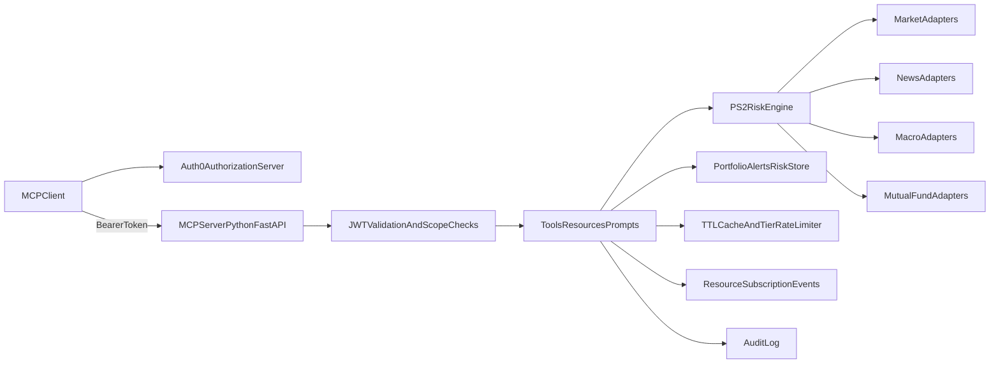

# PS2 MCP Server (Python + Auth0)

Production-style MCP server implementation for **AI League #3 - Use Case 2 (Portfolio Risk & Alert Monitor)**.

## What this implements

- MCP primitives for PS2:
  - Tools, resources, prompts, and tier-aware capability discovery.
- OAuth resource-server behavior with Auth0:
  - JWT validation (signature, `exp`, `aud`, `iss`)
  - scope and tier enforcement
  - `401` with `WWW-Authenticate` and resource metadata
  - `403` with `insufficient_scope`
- PS2 portfolio/risk system:
  - user portfolio persistence
  - alerts + risk score resources
  - subscriptions for alert/risk updates
  - cross-source `portfolio_risk_report` and `what_if_analysis`
- Reliability:
  - per-tier rate limits (`30/150/500` per hour)
  - TTL caching by data type (`60s`, `30m`, etc.)
  - upstream-aware quota manager + graceful degradation
  - audit logging for each operation

## Tech stack

- Python 3.11
- FastAPI
- PyJWT + Auth0 JWKS validation
- JSON-backed local store (demo-friendly)

## Quick start (local)

1. Create env file:
   - `cp .env.example .env`
2. Fill Auth0 settings in `.env`.
3. Install dependencies:
   - `pip install -e .`
4. Run:
   - `uvicorn app.main:app --reload`
5. Verify:
   - `GET /health`
   - `GET /.well-known/oauth-protected-resource`

## Quick start (Docker)

1. `cp .env.example .env`
2. Set Auth0 values in `.env`
3. `docker compose up --build`

## Auth0 setup notes

- Create an Auth0 API with identifier matching `AUTH0_AUDIENCE`.
- Issue access tokens with these scopes (as needed): `portfolio:read`, `portfolio:write`, `market:read`, `mf:read`, `news:read`, `macro:read`, `macro:historical`, `research:generate`.
- Include custom claim `https://ps2.example.com/tier` with one of:
  - `free`
  - `premium`
  - `analyst`

## Core endpoints

- `GET /.well-known/oauth-protected-resource`
- `GET /mcp/capabilities`
- `GET /mcp/contracts`
- `POST /mcp/tools/{tool_name}`
- `POST /mcp/resources/read`
- `POST /mcp/resources/subscribe`
- `POST /mcp/resources/unsubscribe`
- `GET /mcp/resources/events`
- `POST /mcp/prompts/invoke`

## Key files

- Server entry: `app/main.py`
- Contracts and tier matrix: `app/core/contracts.py`
- Auth enforcement: `app/auth/`
- Tool orchestration: `app/services/mcp_service.py`
- Risk engine: `app/services/risk_engine.py`
- Store/subscriptions/rate-limit/cache/audit: `app/services/`
- Detailed docs:
  - `docs/architecture.md`
  - `docs/technical_explanation.md`
  - `docs/api_reference.md`
  - `docs/schema_reference.md`
  - `docs/scope_tier_matrix.md`
  - `docs/demo_runbook.md`

## Architecture (high-level)

## Demo path (must-show boundary)

1. Free token: add holdings + `get_portfolio_summary` succeeds.
2. Free token: `portfolio_risk_report` returns `403 insufficient_scope`.
3. Premium token: `portfolio_health_check` + `check_mf_overlap` succeed.
4. Premium token: `what_if_analysis` returns `403`.
5. Analyst token: full `portfolio_risk_report` and `what_if_analysis` succeed.
6. Subscribe to `portfolio://{user_id}/alerts`, run health checks, then poll `/mcp/resources/events` to receive updates.

## Disclaimer

This system provides informational analytics and does not provide financial advice.
