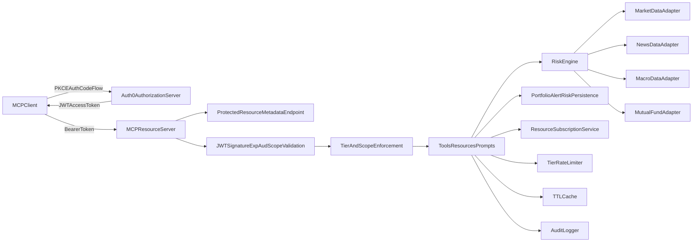

# Architecture Diagram

## Components

- **MCP Resource Server**: FastAPI app exposing tools/resources/prompts.
- **AuthN/AuthZ**: Auth0 JWT validation, tier and scope checks, error semantics.
- **Risk Engine**: Portfolio analytics and cross-source reasoning.
- **Persistence**: User-scoped holdings, alerts, and risk score.
- **Subscriptions**: Event queue for subscribed resources.
- **Reliability controls**: Tier limits, upstream quota tracking, response caching.
