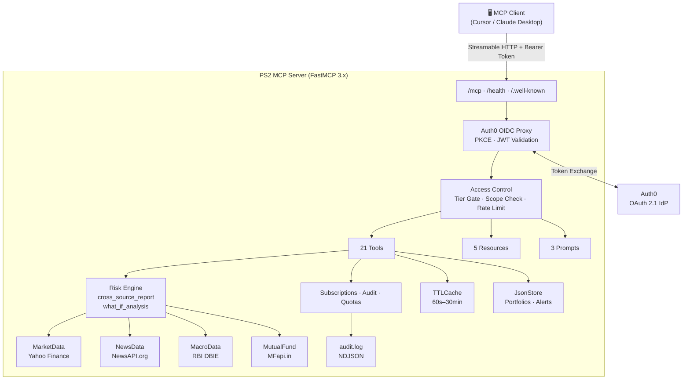
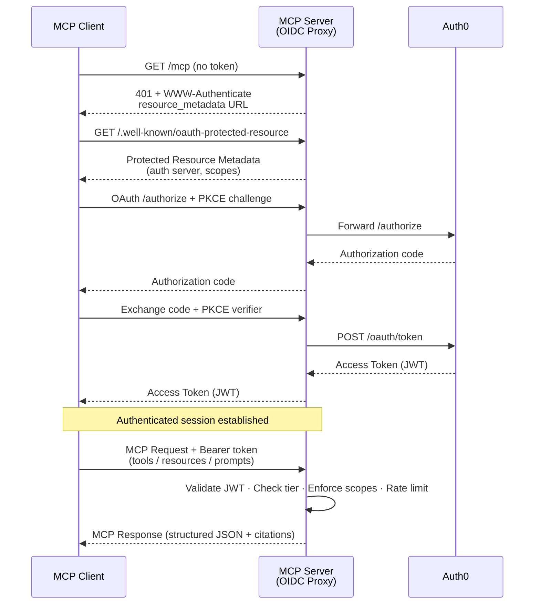
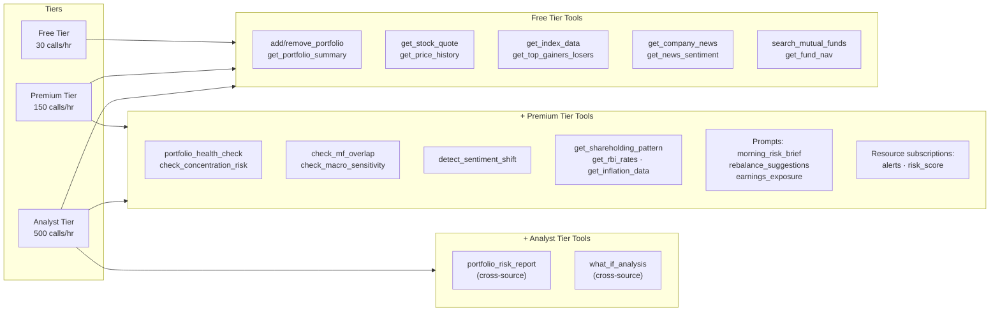
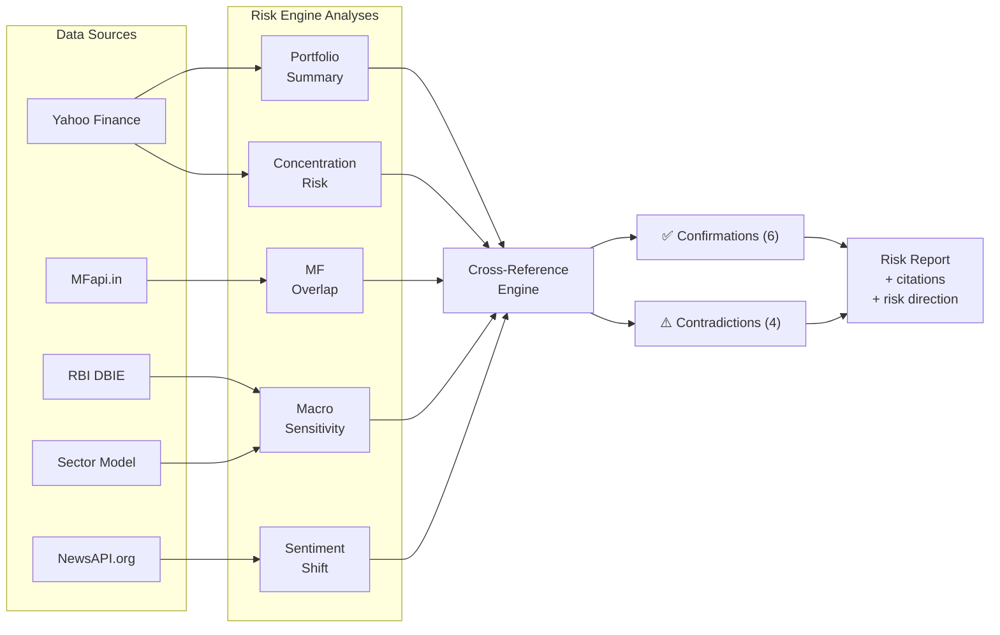
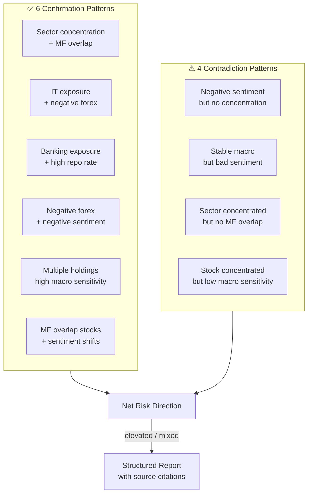

# PS2 MCP Server — Architecture

## High-Level Architecture

### Server Layers (detailed)

```mermaid
flowchart LR
    subgraph Layer1["HTTP Layer"]
        E1["/mcp — MCP transport"]
        E2["/health — status + quotas"]
        E3["/.well-known — RFC 9728"]
        E4["WWW-Authenticate middleware"]
    end

    subgraph Layer2["Auth Layer"]
        O1["OIDC discovery"]
        O2["PKCE code exchange"]
        O3["JWT signature + expiry + aud"]
    end

    subgraph Layer3["Access Control"]
        T1["Tier: free / premium / analyst"]
        T2["Scope enforcement"]
        T3["Rate limit: 30 / 150 / 500 per hr"]
    end

    subgraph Layer4["Service Layer"]
        S1["21 Tools"]
        S2["5 Resources"]
        S3["3 Prompts"]
    end

    subgraph Layer5["Risk Engine"]
        R1["portfolio_summary"]
        R2["concentration_risk"]
        R3["mf_overlap"]
        R4["macro_sensitivity"]
        R5["sentiment_shift"]
        R6["cross_source_report"]
        R7["what_if_analysis"]
    end

    subgraph Layer6["Persistence"]
        P1["TTLCache — quotes 60s, news 30min"]
        P2["JsonStore — portfolios, alerts, scores"]
        P3["audit.log — every invocation"]
    end

    Layer1 --> Layer2 --> Layer3 --> Layer4 --> Layer5 --> Layer6
```

## Auth Flow

## Tier Access Control

## Cross-Source Data Flow

### Confirmation & Contradiction Patterns

## Component Responsibilities

| Component | Responsibility |
|-----------|---------------|
| **FastMCP OIDC Proxy** | Handles OAuth 2.1 discovery, PKCE flow, token exchange with Auth0 |
| **Contract System** | Declares every tool/resource/prompt with required scopes and allowed tiers |
| **Access Control** | Enforces tier + scope checks before every operation |
| **Rate Limiter** | Sliding-window per-user hourly limits (30/150/500) |
| **MCPService** | Orchestrates tool execution, caching, audit, subscriptions |
| **RiskEngine** | Cross-source analysis combining data from 4+ upstream APIs |
| **Data Adapters** | Upstream API clients with graceful fallback on failure |
| **TTLCache** | In-memory cache with per-data-type TTLs |
| **JsonStore** | Persistent user data (portfolios, alerts, risk scores) |
| **AuditLogger** | Append-only NDJSON log of every tool invocation |
| **SubscriptionService** | In-memory pub/sub for resource change events |
| **UpstreamQuotaManager** | Tracks upstream API usage to avoid burning free-tier quotas |

## Tier → Scope → Permission Mapping

See `docs/scope_tier_matrix.md` for the complete mapping.
